# RTOS-pilot

Mã nguồn và mạch điều khiển bay cho UAV cánh cố định sử dụng hệ điều hành thời gian thực FreeRTOS. Mạch sử dụng vi điều khiển chính STM32F407vet6 và vi điều khiển phụ STM32F103c8t6, vi điều khiển phụ được bổ sung nhằm xử lý tình huống khi mạch chính gặp lỗi treo hoặc các lỗi phần cứng khác. Mạch nguyên lý và PCB được thiết kế trên phần mềm Proteus.

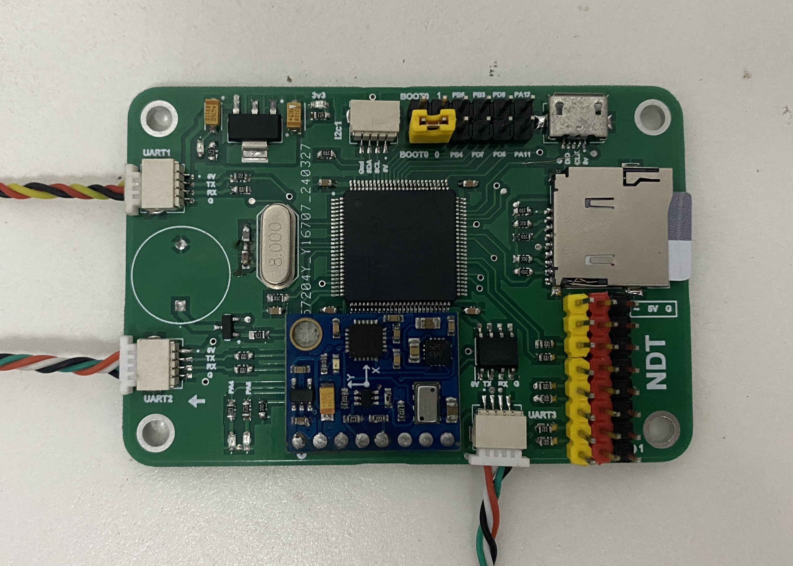

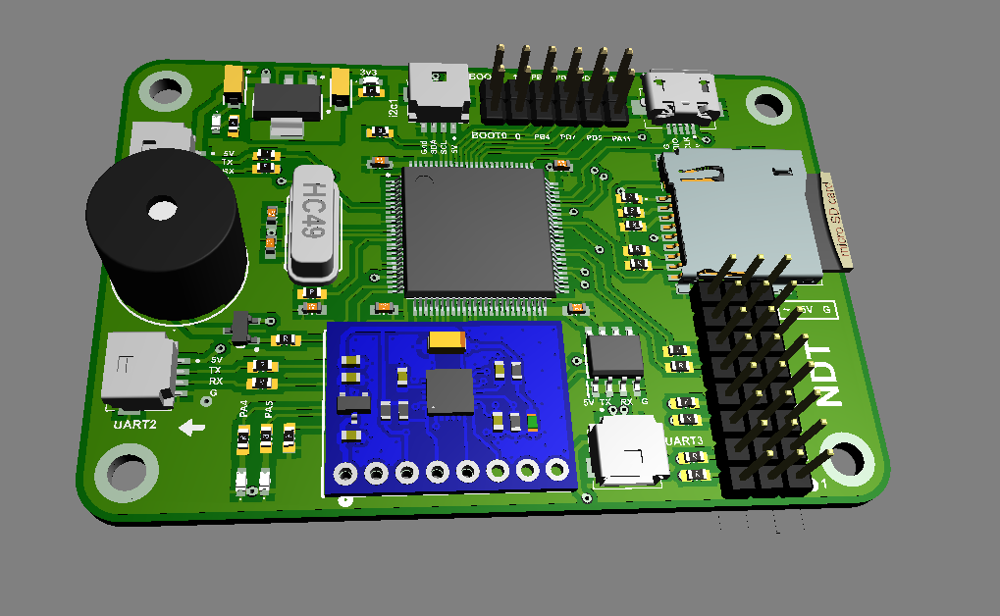 

## Phần cứng
#### Cảm biến và các linh kiện chính
- Cảm biến gia tốc, vận tốc góc 6 trục MPU6050 
- Cảm biến áp suất MS5611 sử dụng để xác định độ cao
- Cảm biến la bàn HMC5883 
- IC nhớ EPPROM AT24C256 lưu giữ các giá trị cấu hình
- Thẻ nhớ sử dụng để lưu dữ liệu bay
- STM32F407vet6 VĐK chính
- STM32F103c8t6 VĐK phụ
- Module GPS M10 và NEO 7M
- Còi chíp báo dộng
#### Các cổng giao tiếp
- 3 Uart
- 1 I2C
- 8 GPIO
- 6 PWM out
- 1 cổng USB sử dụng để nạp chương trình

## Phần mềm

#### Công cụ phát triển
- CubeIDE
- CubeMonitor
- Proteus
- Python
- Matlab

#### Chương trình điều khiển
Sử dụng hệ điều hành RTOS với 3 Task Realtime chính 
- Task 1: Tần số hoạt động 500HZ (do sử dụng giao thức I2C nên tốc độ giao tiếp chậm, có thể cải tiến sử dụng các cảm biến sử dụng SPI như MPU6000 để có thể tăng tốc độ đọc dữ liệu) task đọc và lọc dữ liệu cảm biến MPU6050, với dữ liệu gia tốc sử dụng bộ lọc thông thấp, với vận tốc góc sử dụng bộ lọc trung bình
- Task 2: Tần số 100Hz nhiệm vụ ước lượng góc trạng thái Roll, Pitch, Yaw sử dụng thuật toán Mahony filter kết hợp các phép đo từ cảm biến gia tốc, vận tốc góc và la bàn
- Task 3: Tần số <= 100 Hz, có nhiệm vụ lưu dữ liệu bay vào thẻ nhớ nhằm sử dụng để phân tích dữ liệu cũng như xác định lỗi khi UAV bị rơi 

Sơ đồ hệ thống điều khiển

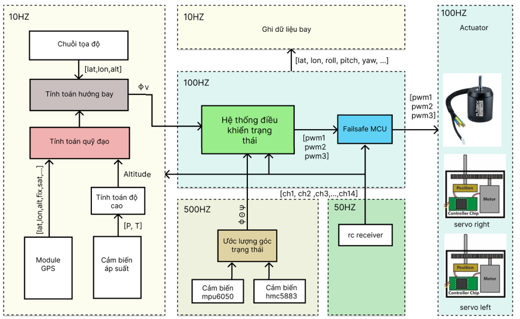

## Bay thử nghiệm
Cấu hình UAV:
- Sải cánh 1.2 m 
- Trọng lượng 0.85 kg
- Vận tốc tối đa 110 km/h
- Thời gian bay 10 - 20 phút
- Motor sunnysky 2216 2400 kv 
- Pin lipo 3s 2200Mah
- Bộ điều khiển Flysky Fs-i6
- Bộ điều tốc 40A
- 2 servo SG-60
- Cam FPV 1800 vlt
- Bộ phát sóng Analog 600mw
- GPS m10 hoặc neo 7m 

Lắp đặt mạch và các linh kiện lên UAV sao cho các mạch và linh kiện được xắp xếp hợp lý đảm bảo cân bằng trọng tâm cho UAV và dễ dàng tháo lắp khi sảy ra hỏng hóc.

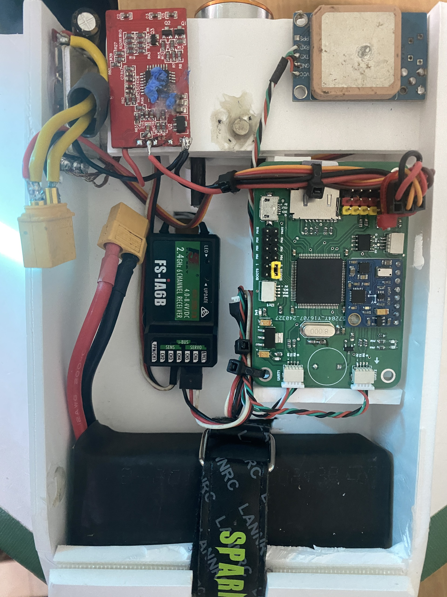 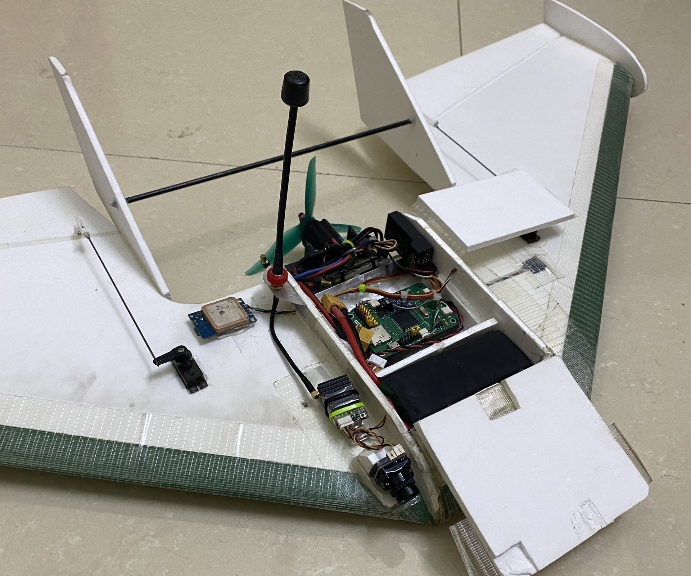

#### Dữ liệu bay thủ công

Dữ liệu bay của UAV trong bay thử nghiệm thu được từ cảm biến GPS với tốc độ cập nhật 10Hz. Dữ liệu được sử dụng để phân tích về nhiễu, độ trôi.

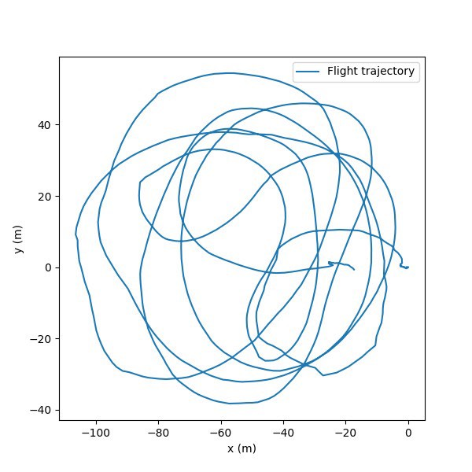 

Hình[1]: Quỹ đạo bay từ GPS

Dữ liệu độ cao thu được thông qua hai phương pháp là sử dụng cảm biến áp suất và cảm biến GPS được so sánh với nhau. Với GPS độ cao có những khoảng bất thường có thể do mất tín hiệu GPS khi máy bay nghiêng, với độ cao từ cảm biến áp suất dữ liệu liên tục hơn không có những khoảng dị thường và có tốc độ lấy mẫu cao hơn so với GPS.

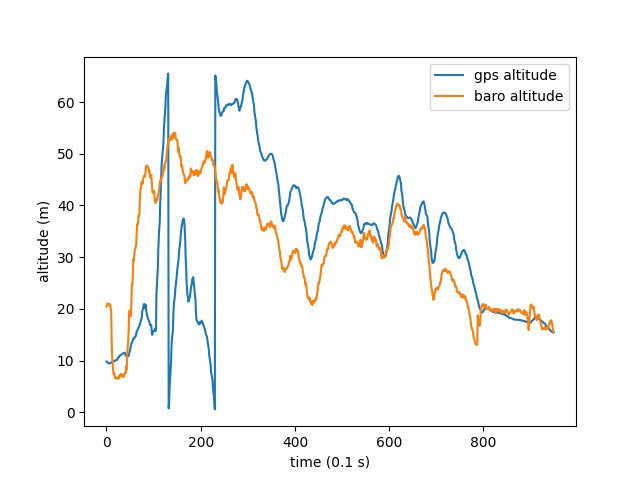 

Hình[2]: Độ cao giữa cảm biến áp suất và GPS

 

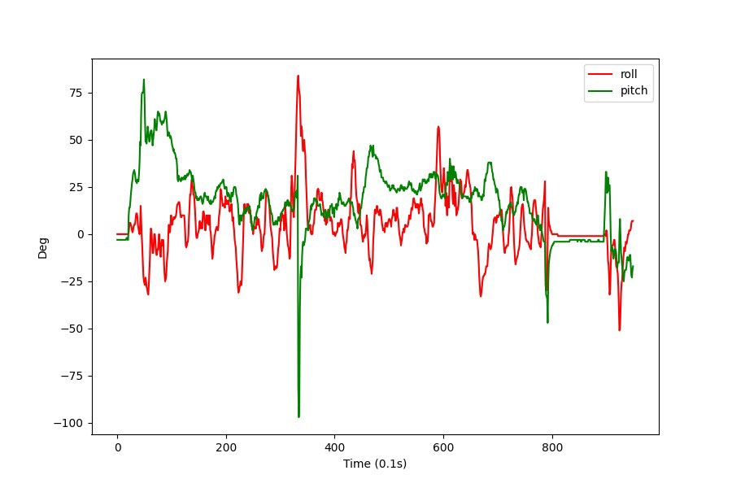 

Hình[3]: Góc Roll và pitch

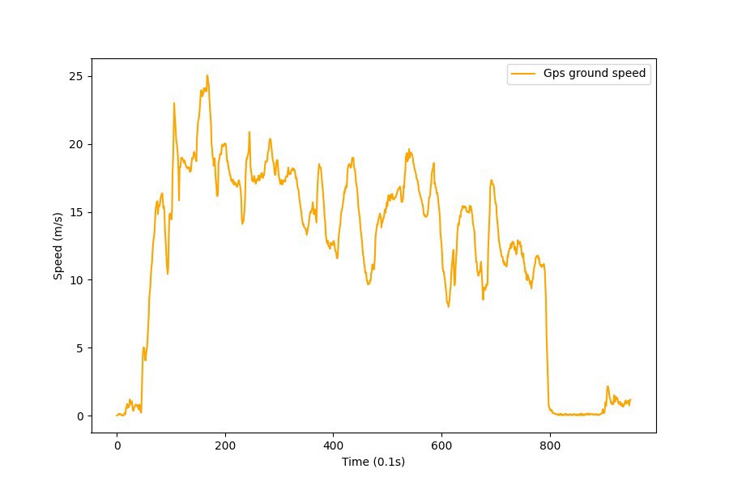 

Hình[4]: Vận tốc mặt đất từ GPS

### Kết quả bay thực tế ổn định trạng thái góc
##### Ổn định góc Roll
Kết quả bay thực tế điều khiển ổn định góc trạng thái góc sau nhiều lần thử nghiệm và tinh chỉnh hệ số. Kết quả góc Roll bám góc mong muốn khá tốt và sai số tĩnh tương đối nhỏ. 

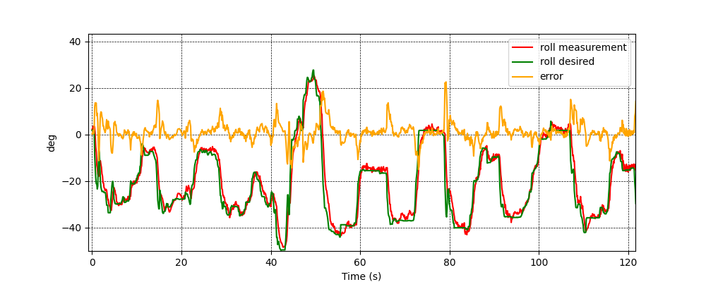

Hình[5]:  Đồ thị đáp ứng trục Roll 

##### Ổn định góc Pitch

Với góc Pitch thời gian đáp ứng còn chậm và sai số tĩnh lớn, tồn tại dao động với tần số cao, các vấn đề trên có thể do vị trí trọng tâm UAV chưa đúng do đó mà trục Pitch rất không ổn định và khó tinh chỉnh PID. 

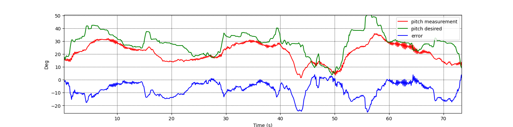

Hình[6]: Đồ thị đáp ứng trục Pitch 

##### Với các trạng thái khác
**Do thời gian thực nghiệm của đồ án khá ngắn và sân bãi  thử nghiệm còn hạn chế nên phần thực nghiệm hiện đang dừng lại ở phần ổn định góc trạng thái các phần như điều khiển vận tốc, độ cao và quỹ đạo vẫn đang tiếp tục được phát triển.**

### Mô phỏng HIL bay bám quỹ đạo

#### Thiết lập phần cứng

Mạch điều khiển bay sử dụng 3 cổng UART, 1 cổng kết nối với mạch Receiver qua giao thức Ibus nhận lệnh điều khiển từ người dùng, 1 cổng để gửi các dữ liệu trạng thái góc, tọa độ đến phần mềm bay giả lập Flightgear qua giao thức Generic , cổng còn lại sử dụng để gửi dữ liệu trạng thái, các thông số điện áp của pin, tốc độ bay, vị trí đến phần mềm giám sát bay Qgroundcontrol qua giao thức Mavlink. Để tránh phải giao tiếp hai chiều với phần mềm Flightgear, mô hình động lực học UAV được nhúng và chạy trong mạch điều khiển.

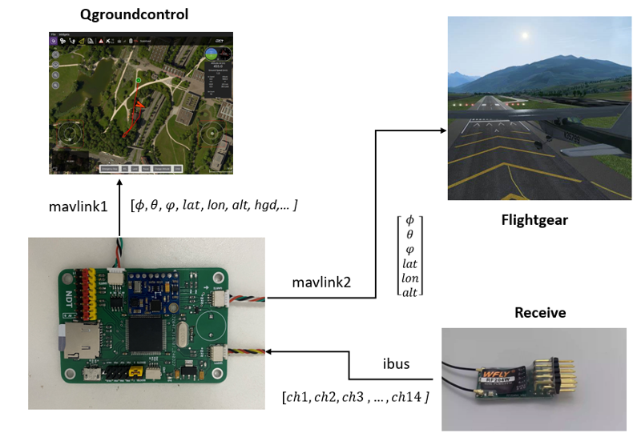

Hình[7]: Thiết lập phần cứng mô phỏng

Phần mềm giám sát được sử dụng là Qgroundcontrol và Flightgear trong đó Qgroundcontrol sử dụng để giám sát máy bay không chỉ trong mô phỏng mà còn trong bay thực tế với máy bay thật, phần mềm hiển thị vị trí các góc trạng thái, vận tốc bay , điện áp pin và dung lượng pin vv. Phần mềm flightgear sử dụng để giám sát trực quan hơn trong quá trình mô phỏng, giúp dễ dàng quan sát đáp ứng của máy bay với lệnh điều khiển cũng như những tác nhân bên ngoài.  

#### Bám quỹ đạo tròn so sánh hai phương pháp Vector fiedl và L1

Thử nghiệm với bán kính 250 m và với các mức gió 0, 10, 20 m/s

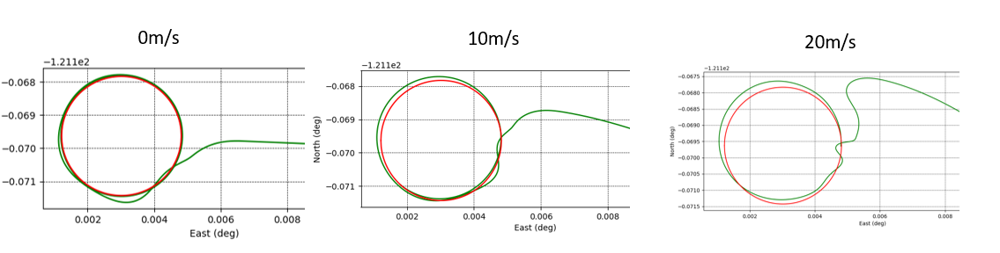

Hình[8]: Quỹ đạo bay với Vector field 

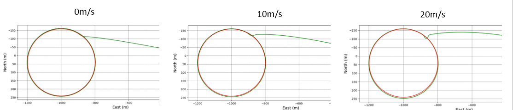

Hình[9]: Quỹ đạo bay với L1 

Từ kết quả mô phỏng có thể thấy phương pháp L1 cho đáp ứng tốt về khả năng bám quỹ đạo cũng như sai số tĩnh là nhỏ nhất, và độ vọt lố rất nhỏ so với trường véc tơ. Do đó mà phương pháp L1 được sử dụng rất phổ biến hiện nay trong các mã nguồn mở như Ardupilot, PX4.

