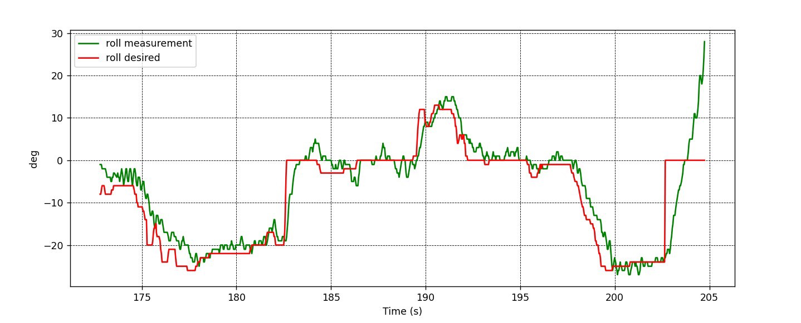

# RTOS-pilot

Flight controller for fixed-wing uav

### Configuration

## Hardware
Flight controller
- 3 uart
- 1 I2C
- 6 PWM output
- 9 GPIO
- MCU stm32f103vct6
- mpu-6050
- hmc-5883 magnetic sensor
- ms-5611  baro
- SD card 
- 24HCxx Epprom ic
### 3d pcb design

 

### Prototye

### Uav

 

## Attitude && PID controller

### Roll axis 

