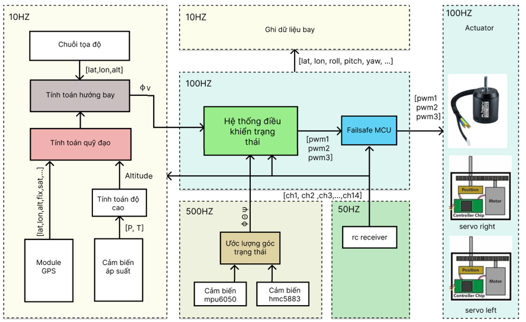

# RTOS-pilot
Mã nguồn và mạch điều khiển bay cho UAV cánh cố định sử dụng hệ điều hành thời gian thực FreeRTOS. Mạch sử dụng vi điều khiển chính STM32F407vet6 và vi điều khiển phụ STM32F103c8t6, vi điều khiển phụ được bổ sung nhằm xử lý tình huống khi mạch chính gặp lỗi treo hoặc các lỗi phần cứng khác. Mạch nguyên lý và PCB được thiết kế trên phần mềm Proteus.

 

## Phần cứng
#### Cảm biến và các linh kiện chính
- Cảm biến gia tốc, vận tốc góc 6 trục MPU6050 
- Cảm biến áp suất MS5611 sử dụng để xác định độ cao
- Cảm biến la bàn HMC5883 
- IC nhớ EPPROM AT24C256 lưu giữ các giá trị cấu hình
- Thẻ nhớ sử dụng để lưu dữ liệu bay
- STM32F407vet6 VĐK chính
- STM32F103c8t6 VĐK phụ
- Module GPS M10 và NEO 7M
- Còi chíp báo dộng
#### Các cổng giao tiếp
- 3 Uart
- 1 I2C
- 8 GPIO
- 6 PWM out
- 1 cổng USB sử dụng để nạp chương trình

## Phần mềm
Sử dụng hệ điều hành RTOS với 3 Task Realtime chính 
- Task 1: tần số 500HZ (do sử dụng giao thức I2C nên tốc độ giao tiếp chậm, có thể cải tiến sử dụng các cảm biến sử dụng SPI như MPU6000 để có thể tăng tốc độ đọc dữ liệu) task đọc và lọc dữ liệu cảm biến MPU6050, với dữ liệu gia tốc sử dụng bộ lọc thông thấp, với vận tốc góc sử dụng bộ lọc trung bình
- Task 2: Tần số 100Hz nhiệm vụ ước lượng góc trạng thái Roll, Pitch, Yaw sử dụng thuật toán Mahony filter kết hợp các phép đo từ cảm biến gia tốc, vận tốc góc và la bàn
- Task 3: Tần số <= 100 Hz, có nhiệm vụ lưu dữ liệu bay vào thẻ nhớ nhằm sử dụng để phân tích dữ liệu cũng như xác định lỗi khi UAV bị rơi 

Sơ đồ hệ thống điều khiển

## Bay thử nghiệm
Cấu hình UAV:
- Sải cánh 1.2 m 
- Trọng lượng 0.85 kg
- Vận tốc tối đa 110 km/h
- Thời gian bay 10 - 20 phút

Cấu hình đồ điện:

- Motor sunnysky 2216 2400 kv 
- Pin lipo 3s 2200Mah
- Bộ điều khiển Flysky Fs-i6
- Bộ điều tốc 40A
- 2 servo SG-60
- Cam FPV 1800 vlt
- Bộ phát sóng analog 600mw
- gps m10 or neo 7m 

Lắp đặt mạch và các linh kiện lên UAV

 

## Dữ liệu bay thủ công

Quỹ đạo bay từ GPS

 

Độ cao giữa cảm biến áp suất và GPS

 

góc Roll và pitch 

 

Ground speed from gps

 

### Attitude && PID controller

Roll axis 

Pitch axis 

