# RTOS-pilot

Flight controller for fixed-wing uav
## Hardware
- 3 uart
- 1 I2C
- 6 PWM output
- 9 GPIO
- MCU stm32f407vet6
- mpu-6050
- hmc-5883 magnetic sensor
- ms-5611  baro
- SD card 
- 24HCxx Epprom ic

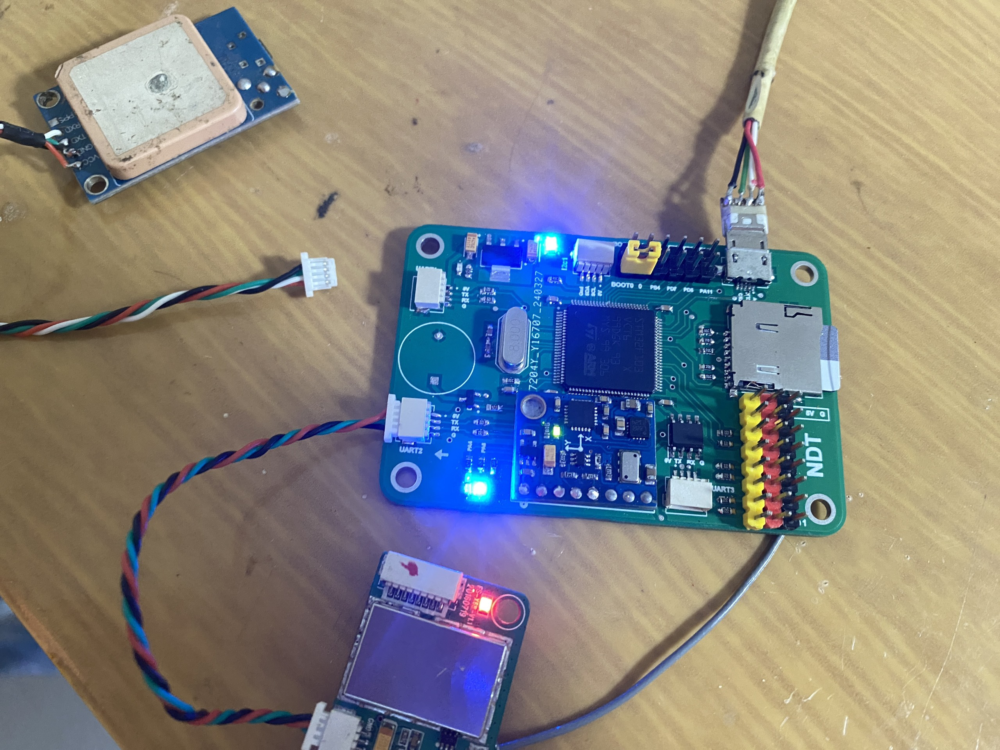

### Configuration
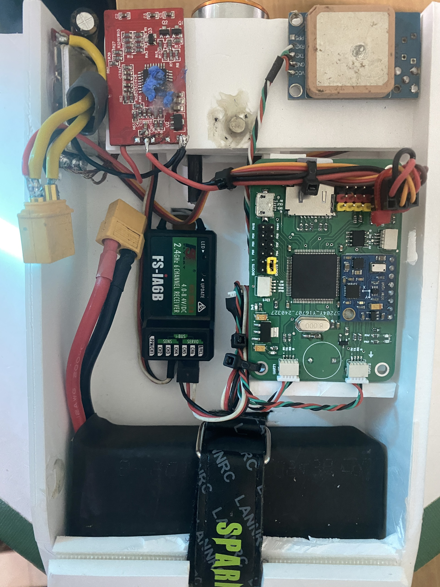

### 3d pcb design

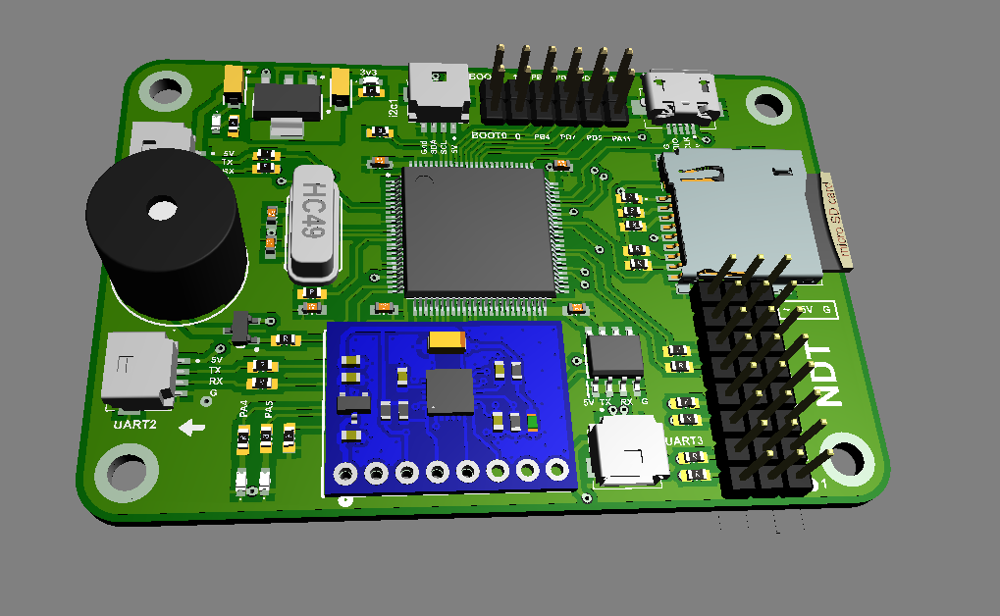 

### Prototype
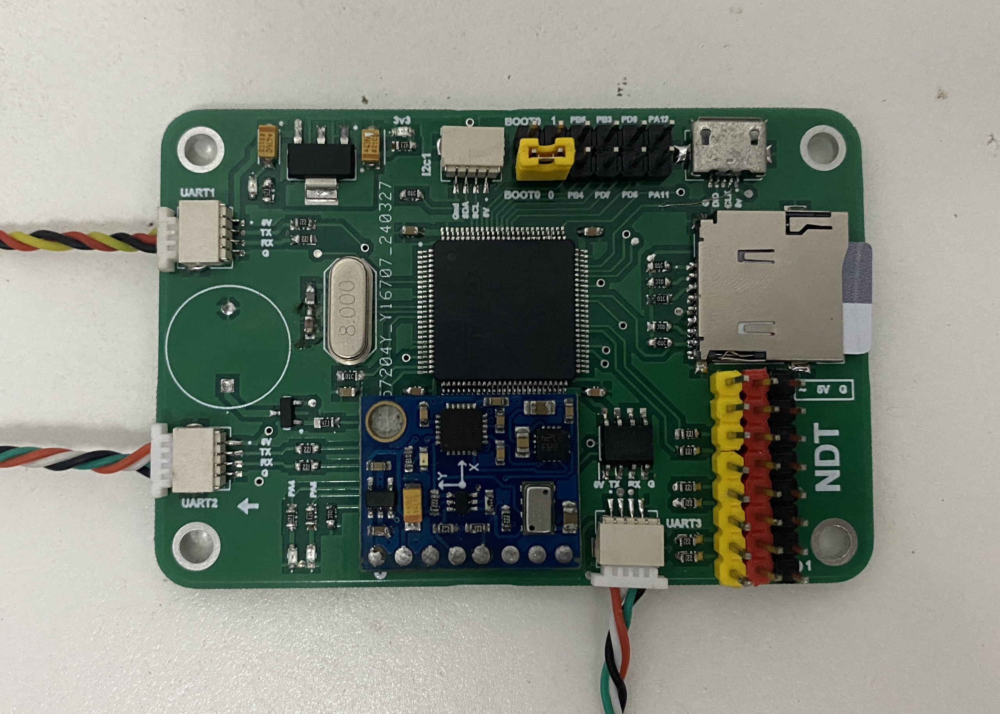

### Uav
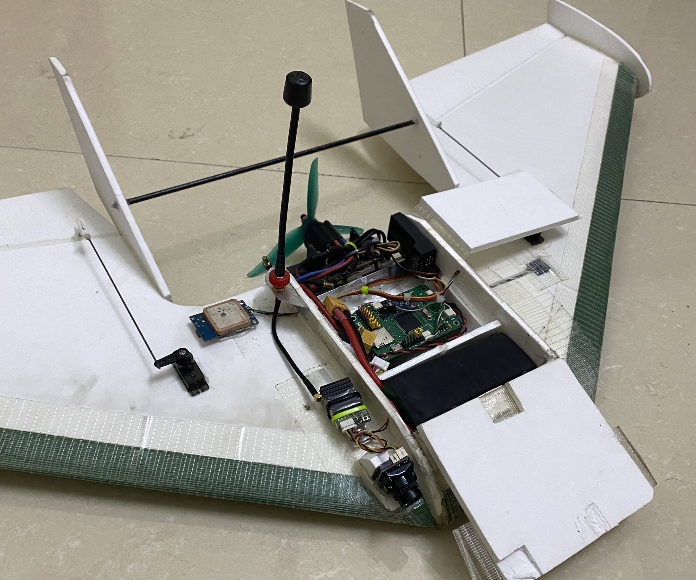 

## Manual fight data
### Flight trajectory 
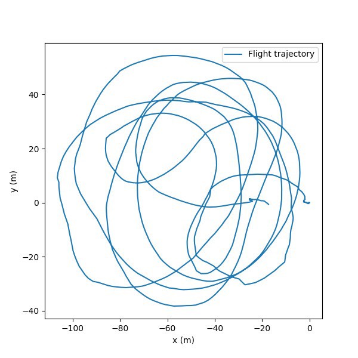 

### Altitude baro vs gps
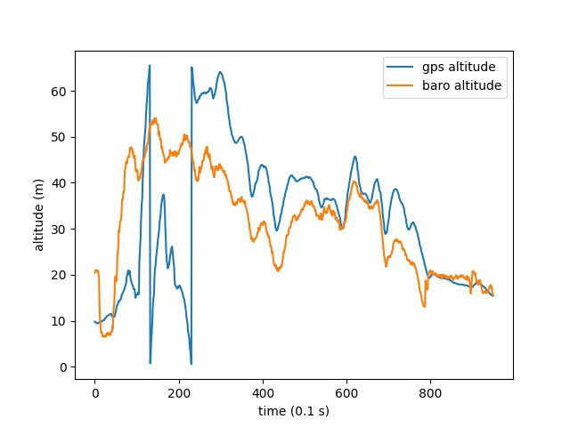 

### Roll && pitch angle
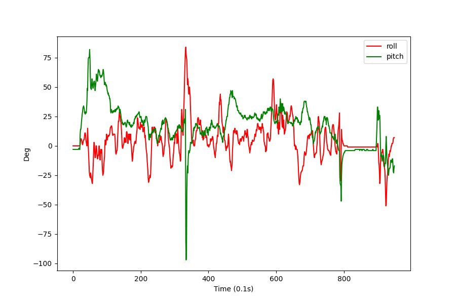 

### Ground speed from gps
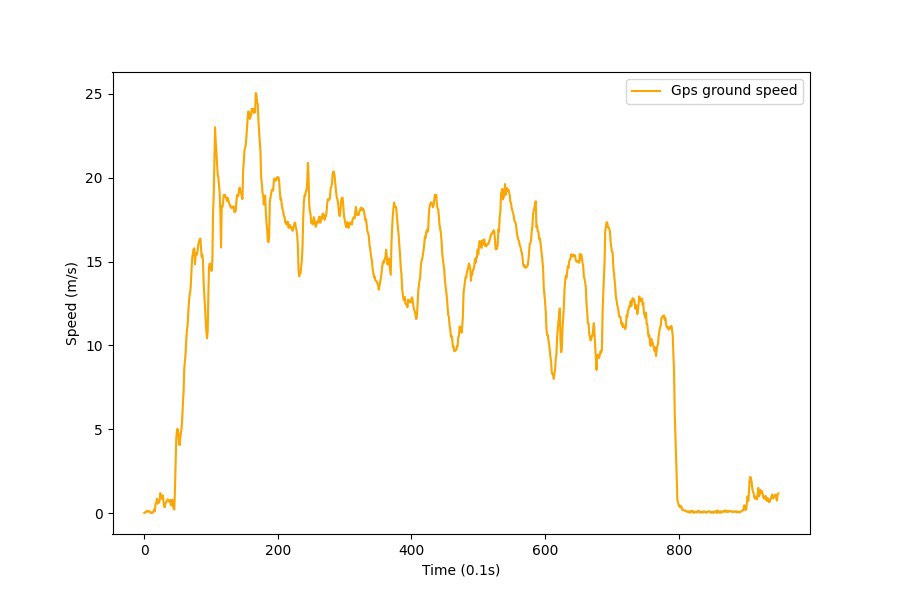 

## Attitude && PID controller

### Roll axis 

[//]:

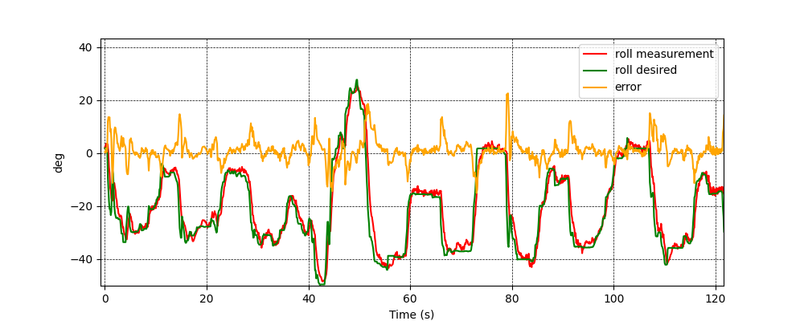

### Pitch axis 

[//]:

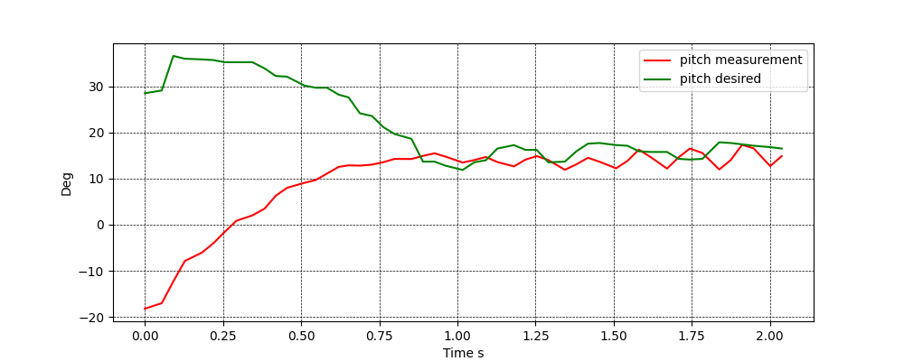

### Altitude comparison

[//]:

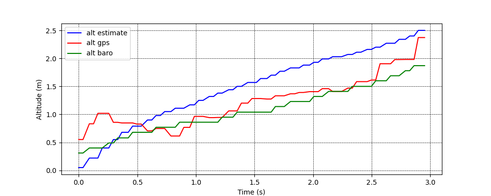

